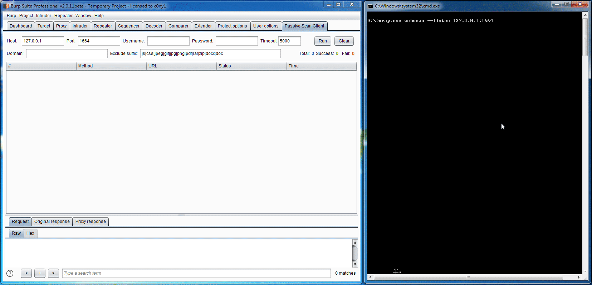
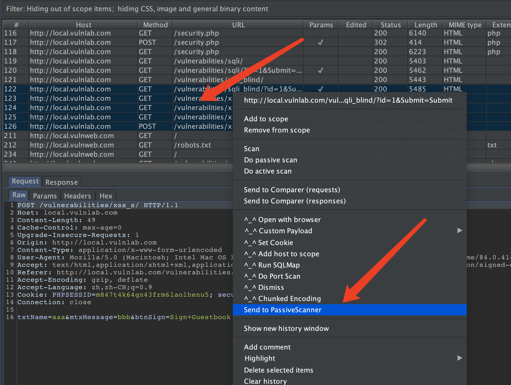
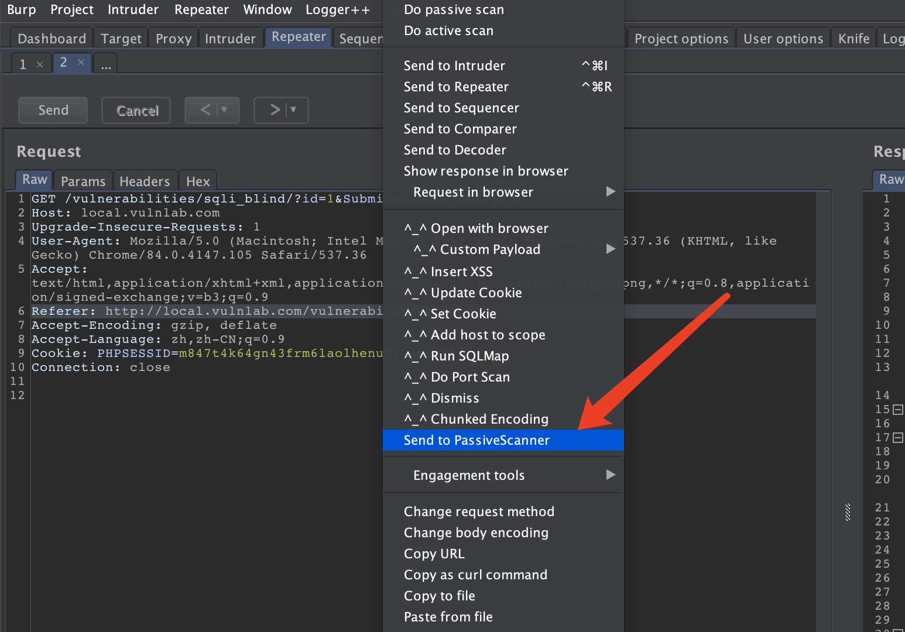
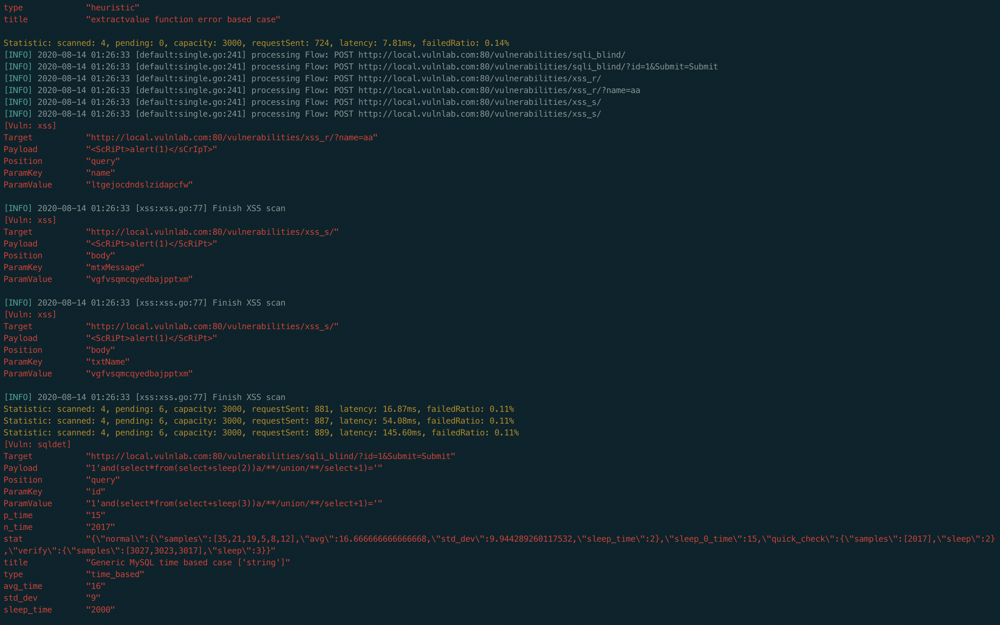

# Passive Scan Client and Sendto | Burp被动扫描流量自动转发和手动重发插件

## 0x00 插件说明：基于@c0ny1师傅的被动扫描流量自动转发的基础上添加右键手动重发的功能

首先感谢@c0ny1师傅的开源工具:
* [c0ny1](https://github.com/c0ny1/passive-scan-client) 被动扫描流量转发插件

## 0x01 插件简介

```
Q1: 将浏览器代理到被动扫描器上，访问网站变慢，甚至有时被封ip，这该怎么办？   ---------->    流量规则自动转发被动扫描器
Q2: 需要人工渗透的同时后台进行被动扫描，到底是代理到burp还是被动扫描器？    ---------->    流量规则自动转发到被动扫描器
Q3: 使用burp人工渗透审查proxy history和手动检测的时候想偷懒怎么办？      ---------->    流量手动重发到被动扫描器
```

该插件正是为了解决该问题，将`正常访问网站的流量`与`提交给被动扫描器的流量`分开，互不影响,同时为了方便手工检测的时候顺带重发特定流量至被动扫描器，手工挖洞更多地着重于逻辑之类的扫描器难以检测的漏洞，被动扫描则帮我们解决传统漏洞的检测，双线进行省时省力哈哈。

## 0x02 插件编译

```
mvn package (或者idea直接导入生成jar文件也可)
```

## 0x03 插件演示

可以通过插件将流量转发到各种被动式扫描器中，这里我选`xray`来演示.

根据规则自动转发：


Burp proxy-history/Repeater 中右键手动转发




## 0x04 注意事项
- 手动重发不受自动转发规则的限制
- 端口修改后需要run一下触发配置修改，手动重发才会使用新端口
## 0x05 参考
* [c0ny1](https://github.com/c0ny1/passive-scan-client) 被动扫描流量转发插件